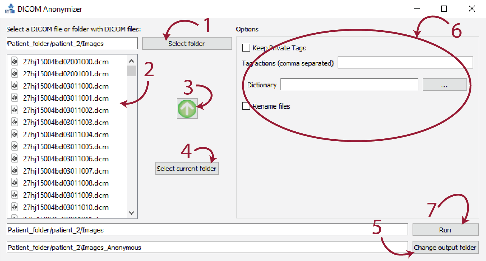

    

# DICOMAnonymizer: GUI interface

Graphical user interface built on top of Kitware Medical's DICOM Anonymization tool: https://github.com/KitwareMedical/dicom-anonymizer

### DISCLAIMER: Work in progress. Use at your own risk.

# 🧾 Instructions

    

<ol>
    <li><b>Select folder</b>: select the folder where the DICOM image(s) is located.</li>
    <li><b>File list</b>: click on the single DICOM file to anonymize.</li>
    <li><b>⬆</b>: travel one level up in the file system.</li>
    <li><b>Select current folder</b>: if current directory contains the DICOM files, use this button to select the whole directory.</li>
    <li><b>Change output folder</b>: change the default directory where the anonymized images will be stored.</li>
    <li><b>Options</b>: see https://github.com/KitwareMedical/dicom-anonymizer for more information on the options.</li>
    <li><b>Run</b>: anonymize the selected file or directory.</li>
</ol>

# 🏆 Acknowledgements
<ul>
<li>Work originally done by Edern Haumont</li>
<li>Kitware Medical: https://github.com/KitwareMedical/dicom-anonymizer</li>
</ul>
