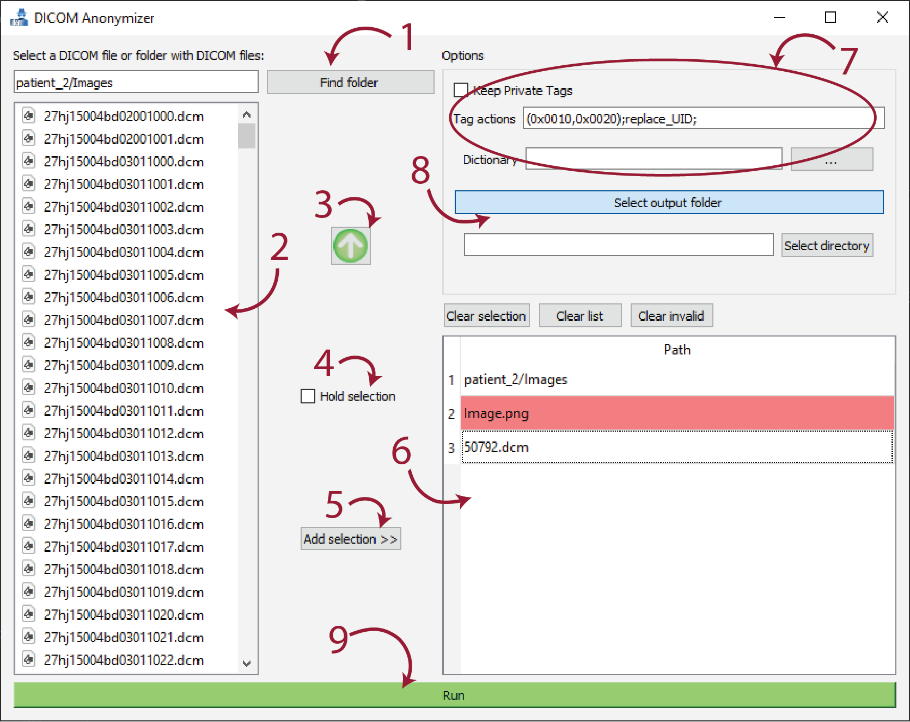

    

# DICOMAnonymizer: GUI interface

Graphical user interface built on top of Kitware Medical's DICOM Anonymization tool: https://github.com/KitwareMedical/dicom-anonymizer

### DISCLAIMER: Work in progress. Use at your own risk.

# 🧾 Instructions

    

<ol>
    <li><b>Select folder</b>: select the folder where the DICOM image(s) is located.</li>
    <li><b>File list</b>: click on the single DICOM file to anonymize.</li>
    <li><b>⬆</b>: travel one level up in the file system.</li>
    <li><b>Hold selection</b>: keep the selected object highlighted without pressing CTRL or SHIFT.</li>
    <li><b>Add selection >></b>: Add the selected objects to the list (6).</li>
    <li><b>List of selected objects</b>: invalid items will be shown in red. Use the buttons above to edit the list:</li>
        <ul>
            <li>Clear selection: remove the selected objects.</li>
            <li>Clear list: remove all the items in the list.</li>
            <li>Clear invalid: remove only the invalid items (red).</li>
        </ul>
    <li><b>Options</b>: see https://github.com/KitwareMedical/dicom-anonymizer for more information on the options.</li>
    <li><b>Select output folder</b>: allows the user to define the output folder. Here a new folder named <i>Anonymized_DATE_TIME</i> will be created.</li>
    <li><b>Run</b>: processed the valid files/directories in the selection list. A progress bar will show up, and when done you will be given the option to open the output folder.</li>
</ol>

Notice that:
<ul>
    <li>By default, the output folder will be in the installation directory.</li>
    <li>When adding a folder, the application expects to find DICOM images within it. It will <b>not check subfolers</b> within the first one.</li>
</ul>

## ⚙ How to use it

<ol>
<li>Select the directory where the images are contained using (1).</li>
<li>Select the file(s)/folder(s) in (2) and press <i>Add selection >></i> (5) to add these to the <i>Selection list</i> (6).</li>
<li>Edit the <i>Selection list</i> (6) using the buttons above it.</li>
<li>Edit the options (7) if needed.</li>
<li>Press <i>Run</i> (9) when ready!</li>
</ol>

# 🏆 Acknowledgements
<ul>
<li>Work originally done by Edern Haumont</li>
<li>Kitware Medical: https://github.com/KitwareMedical/dicom-anonymizer</li>
</ul>
